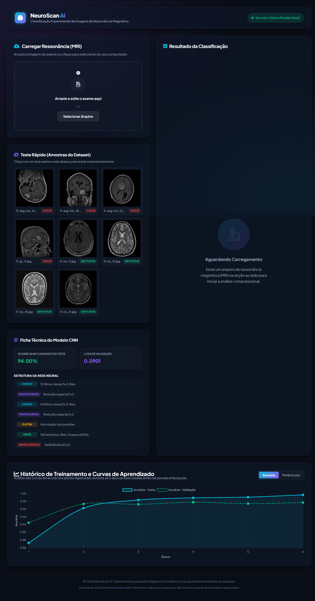
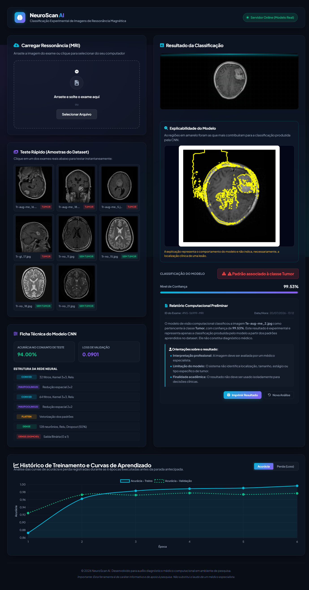

# 🧠 NeuroScan AI

Sistema de Inteligência Artificial para detecção de tumores cerebrais em imagens de Ressonância Magnética (MRI) utilizando Redes Neurais Convolucionais (CNN) e técnicas de Inteligência Artificial Explicável (XAI).


---

# 📖 Sobre o Projeto

O **NeuroScan AI** é uma aplicação web desenvolvida para auxiliar na classificação automática de exames de Ressonância Magnética (MRI), identificando a presença ou ausência de tumores cerebrais por meio de uma Rede Neural Convolucional (CNN).

Além da classificação, o sistema utiliza o algoritmo **LIME (Local Interpretable Model-Agnostic Explanations)** para fornecer uma explicação visual da decisão tomada pela inteligência artificial, aumentando a transparência e interpretabilidade do modelo.

Este projeto foi desenvolvido como trabalho do curso de **Inteligência Artificial da OxeTech**.

---

# ✨ Funcionalidades

- Upload de imagens de Ressonância Magnética (MRI)
- Classificação automática em:
  - Tumor
  - Sem Tumor
- Exibição da probabilidade da previsão
- Exibição da confiança do modelo
- Explicabilidade utilizando LIME (XAI)
- Interface Web intuitiva
- API REST desenvolvida com FastAPI
- Containerização utilizando Docker

---

# 📸 Interface

## Tela Inicial



---

## Resultado da Classificação
## Explicabilidade com LIME


---


---

# 🏗️ Arquitetura do Sistema

```text
              Usuário
                  │
                  ▼
         Interface Web (HTML/CSS/JS)
                  │
                  ▼
              FastAPI (Backend)
                  │
        ┌─────────┴─────────┐
        ▼                   ▼
 TensorFlow CNN         LIME (XAI)
        │                   │
        └─────────┬─────────┘
                  ▼
        Resultado da Classificação
```

---

# 🧠 Tecnologias Utilizadas

## Backend

- Python
- FastAPI
- TensorFlow / Keras
- NumPy
- Pillow
- LIME
- Scikit-image

## Frontend

- HTML5
- CSS3
- JavaScript

## Ferramentas

- Docker
- Git
- GitHub
- Git LFS

---

# 📂 Estrutura do Projeto

```text
BRAIN_TUMOR_DETECTION_AI
│
├── api/
│   ├── main.py
│   └── lime_explainer.py
│
├── frontend/
│   ├── index.html
│   ├── script.js
│   └── style.css
│
├── models/
│   └── brain_tumor_cnn_v2.keras
│
├── datasets/
│
├── notebooks/
│
├── README/
│   ├── home.png
│   ├── prediction.png
│   └── lime.png
│
├── Dockerfile
├── requirements.txt
└── README.md
```

---

# 🚀 Como executar o projeto

## 1. Clone o repositório

```bash
git clone https://github.com/SEU-USUARIO/BRAIN_TUMOR_DETECTION_AI.git
```

## 2. Acesse a pasta

```bash
cd BRAIN_TUMOR_DETECTION_AI
```

## 3. Instale as dependências

```bash
pip install -r requirements.txt
```

## 4. Execute a aplicação

```bash
python -m uvicorn api.main:app --reload
```

## 5. Acesse

```
http://127.0.0.1:8000
```

---

# 🐳 Executando com Docker

## Construir a imagem

```bash
docker build -t brain-tumor-ai .
```

## Executar

```bash
docker run --rm -p 8000:10000 brain-tumor-ai
```

Depois acesse:

```
http://localhost:8000
```

---

# 📊 Modelo de Inteligência Artificial

O modelo foi desenvolvido utilizando Redes Neurais Convolucionais (CNN) para classificação binária de imagens de Ressonância Magnética.

Fluxo de processamento:

1. Upload da imagem.
2. Pré-processamento.
3. Classificação pela CNN.
4. Cálculo das probabilidades.
5. Geração da explicação utilizando LIME.
6. Exibição do resultado ao usuário.

---

# 🔍 Inteligência Artificial Explicável (LIME)

Para aumentar a interpretabilidade do modelo, o projeto utiliza **LIME**, uma técnica de Inteligência Artificial Explicável (XAI).

O algoritmo destaca visualmente as regiões da imagem que tiveram maior influência na decisão da CNN, permitindo compreender melhor o comportamento do modelo durante a classificação.

---

# ⚠️ Aviso

Este projeto possui finalidade exclusivamente acadêmica e educacional.

Os resultados apresentados **não substituem avaliação médica profissional** e **não devem ser utilizados para diagnóstico clínico**.

---

# 👨‍💻 Autor

**Arthur Fernandes**

- Bacharelado em Sistemas de Informação
- Projeto desenvolvido durante o curso de Inteligência Artificial da OxeTech

---

# 📄 Licença

Este projeto está licenciado sob a licença MIT.
